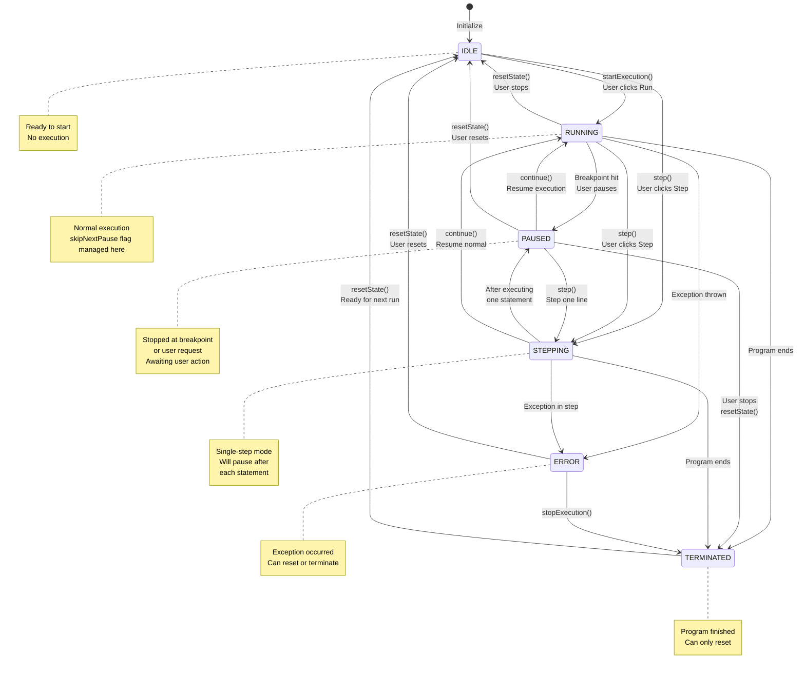
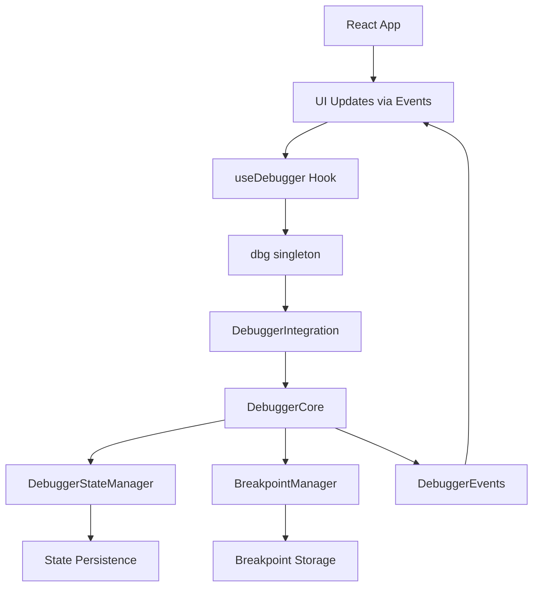
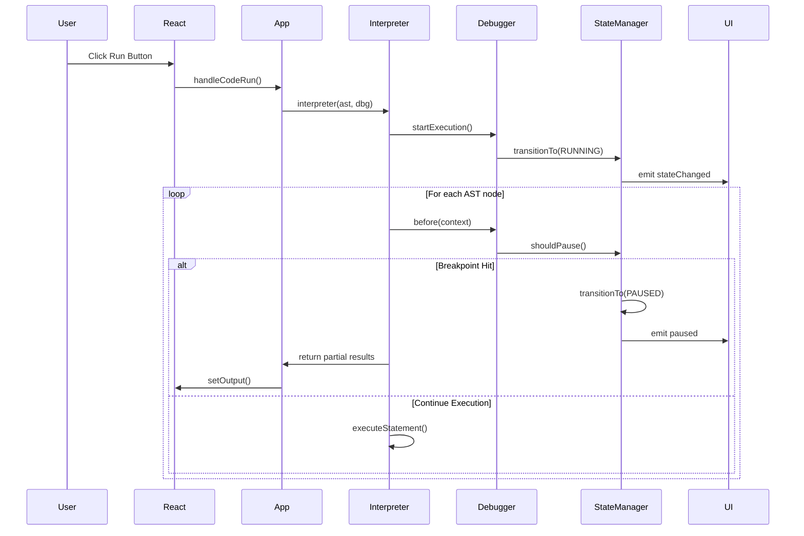

# NanoBasic Debugger Architecture

## TL;DR

**What**: A modern, React-based debugger for the NanoBasic interpreter with breakpoints, step execution, and state inspection.

**Architecture**:
- **Core**: TypeScript classes (`DebuggerCore`, `BreakpointManager`, `StateManager`) handle execution control
- **UI**: React component (`DebuggerPanel`) with hooks (`useDebugger`) for state management
- **Integration**: Clean separation - core logic in `src/interpreter/`, UI in `src/components/`

**Key Files**:
- `src/interpreter/DebuggerCore.ts` - Main debugging engine
- `src/components/Debugger/DebuggerPanel.tsx` - React UI component
- `src/hooks/useDebugger.ts` - React state hook
- `src/interpreter/Debugger.ts` - Export hub (import from here)

**Usage**:
```typescript
import { dbg } from './interpreter/Debugger';

// In your interpreter
await dbg.before(context);  // Check for breakpoints/pause

// In your React app
const { debuggerState, callbacks } = useDebugger();
<DebuggerPanel callbacks={callbacks} {...state} />
```

**Features**: Step execution (INTO/OVER/OUT), conditional breakpoints, hit counts, event-driven state updates, responsive mobile-first UI, keyboard shortcuts, touch gestures.

**Recent Changes** (Jan 2025): Removed 900+ lines of deprecated vanilla JS UI code. Now 100% React-based.

---

## Overview

The NanoBasic debugger is a sophisticated, React-based debugging system that provides step-by-step execution, breakpoint management, and runtime inspection capabilities for BASIC programs. It features a modern responsive UI, asynchronous execution control, comprehensive state management, and advanced breakpoint capabilities.

## File Structure

### Core Interpreter Files
- `src/interpreter/DebuggerCore.ts` - Main debugging engine
- `src/interpreter/DebuggerStateManager.ts` - State machine and execution state
- `src/interpreter/BreakpointManager.ts` - Breakpoint management
- `src/interpreter/DebuggerEvents.ts` - Event system
- `src/interpreter/DebuggerIntegration.ts` - Wrapper for backward compatibility
- `src/interpreter/Debugger.ts` - Main export hub (re-exports all components)

### React Components
- `src/components/Debugger/DebuggerPanel.tsx` - Main UI component
- `src/components/Debugger/DebuggerPanel.module.css` - Component styles
- `src/hooks/useDebugger.ts` - React hook for debugger state management

### Type Flow
```
DebuggerPanel.tsx (defines types)
    ↓
Debugger.ts (re-exports types)
    ↓
Application code (imports from Debugger.ts)
```

## Current Architecture (React-Based)

### 🔧 **Core Components**

#### 1. **DebuggerCore** (`src/interpreter/DebuggerCore.ts`)
The main debugging engine that manages execution flow and state.

**Key Features:**
- **Enhanced Step Modes**: RUN, INTO, OVER, OUT execution modes with proper state machine
- **Advanced Breakpoint Management**: Conditional breakpoints, hit counts, import/export
- **Event-Driven Architecture**: Comprehensive event system for state changes
- **Asynchronous Control**: Non-blocking pause/resume with proper state persistence
- **Context Inspection**: Deep runtime inspection capabilities

#### 2. **DebuggerStateManager** (`src/interpreter/DebuggerStateManager.ts`)
Manages debugger execution states with proper state machine validation.

**States:**
```typescript
enum DebuggerState {
    IDLE = 'idle',           // Not executing
    RUNNING = 'running',     // Normal execution
    PAUSED = 'paused',       // Paused at breakpoint/step
    STEPPING = 'stepping',   // Single-step mode
    ERROR = 'error',         // Exception occurred
    TERMINATED = 'terminated' // Execution finished
}
```

**Features:**
- State transition validation
- Execution context tracking
- State persistence to localStorage
- Event-driven state changes
- History tracking for debugging

**State Transition Diagram:**



**Valid State Transitions:**
```typescript
const STATE_TRANSITIONS = {
    IDLE: ['RUNNING', 'STEPPING'],
    RUNNING: ['PAUSED', 'STEPPING', 'ERROR', 'TERMINATED', 'IDLE'],
    PAUSED: ['RUNNING', 'STEPPING', 'TERMINATED', 'IDLE'],
    STEPPING: ['PAUSED', 'RUNNING', 'ERROR', 'TERMINATED'],
    ERROR: ['IDLE', 'TERMINATED'],
    TERMINATED: ['IDLE']
};
```

**Key State Behaviors:**
- **IDLE**: Initial state, waiting to start execution
- **RUNNING**: Normal execution, checks breakpoints between statements
- **PAUSED**: Execution halted, user can inspect state or continue
- **STEPPING**: Executes one statement then transitions to PAUSED
- **ERROR**: Exception occurred, debugging information preserved
- **TERMINATED**: Execution completed, can only reset to IDLE

**Special Flags:**
- `skipNextPause`: Set during `continue()` to skip immediate re-break on same line
- `stepMode`: Tracks step type (INTO, OVER, OUT) for different stepping behaviors

#### 3. **BreakpointManager** (`src/interpreter/BreakpointManager.ts`)
Advanced breakpoint management system.

**Capabilities:**
```typescript
interface Breakpoint {
    id: string;
    location: SourceLocation;
    enabled: boolean;
    condition?: BreakpointCondition;
    hitCount: number;
    createdAt: Date;
    lastHit?: Date;
    logMessage?: string;
}
```

- Conditional breakpoints (expressions, hit counts)
- Import/export functionality
- Event-driven updates
- Statistics and analytics
- Persistent storage

#### 4. **React UI Components**

##### **DebuggerPanel** (`src/components/Debugger/DebuggerPanel.tsx`)
Modern React component with full responsiveness and accessibility.

**Features:**
- **Responsive Design**: Mobile-first with CSS modules
- **Touch Support**: Swipe gestures, pinch-to-zoom, resize handles
- **Keyboard Shortcuts**: F5/F10/F9 plus Ctrl/Cmd combinations
- **Accessibility**: ARIA labels, screen reader support, high contrast
- **Dark Mode**: Automatic system preference detection

##### **useDebugger Hook** (`src/hooks/useDebugger.ts`)
Custom React hook for debugger state management.

**API:**
```typescript
const {
    debuggerState,      // Current debugger state
    breakpoints,        // Array of breakpoints
    stats,             // Breakpoint statistics
    isVisible,         // Panel visibility
    callbacks,         // Action callbacks
    setVisible,        // Show/hide panel
    addMessage,        // Add debug message
    clearMessages      // Clear messages
} = useDebugger(options);
```

### 🔄 **Integration Architecture**

#### **DebuggerIntegration** (`src/interpreter/DebuggerIntegration.ts`)
Thin wrapper around DebuggerCore that provides a unified API for backward compatibility. All UI functionality has been moved to React components.

**Key responsibilities:**
- Exposes core debugger methods (`continue()`, `step()`, `addBreakpoint()`, etc.)
- Maintains backward compatibility for existing code
- No UI dependencies - purely functional wrapper



## Control Flow Architecture

### **Overview**

The NanoBasic debugger implements a sophisticated control flow architecture that manages program execution through multiple layers of state management, event coordination, and React integration. The system uses a state machine approach with proper transitions, event-driven updates, and asynchronous execution control.

### **1. Execution Lifecycle**



### **2. State Machine Architecture**

#### **Core States**
```typescript
enum DebuggerState {
    IDLE = 'idle',           // Ready to start execution
    RUNNING = 'running',     // Normal program execution  
    PAUSED = 'paused',       // Stopped at breakpoint/step
    STEPPING = 'stepping',   // Single-step execution mode
    ERROR = 'error',         // Exception handling
    TERMINATED = 'terminated' // Program completed
}
```

#### **State Transition Matrix**
```typescript
const STATE_TRANSITIONS = {
    IDLE: [RUNNING, STEPPING],                    // Can start execution
    RUNNING: [PAUSED, ERROR, TERMINATED, IDLE],  // Can pause, error, or complete
    PAUSED: [RUNNING, STEPPING, TERMINATED, IDLE], // Can resume or terminate
    STEPPING: [PAUSED, RUNNING, ERROR, TERMINATED], // Can pause or continue
    ERROR: [IDLE, TERMINATED],                    // Can reset or terminate
    TERMINATED: [IDLE]                            // Can only reset
};
```

#### **Transition Validation**
```typescript
transitionTo(newState: DebuggerState, reason?: string): boolean {
    // 1. Validate transition is allowed
    if (!this.isValidTransition(this.currentState, newState)) {
        console.warn(`Invalid transition: ${this.currentState} -> ${newState}`);
        return false;
    }
    
    // 2. Update state
    const oldState = this.currentState;
    this.currentState = newState;
    
    // 3. Handle state-specific logic
    if (newState !== DebuggerState.PAUSED) {
        this.pauseReason = null;
    }
    
    // 4. Record transition and notify
    this.recordTransition(oldState, newState, reason);
    this.emitStateChange();
    
    return true;
}
```

### **3. Execution Control Flow**

#### **A. Program Start Flow**
```typescript
// 1. User clicks Run button
handleCodeRun(code) {
    // Parse code into AST
    const ast = parser(lexer(code));
    
    // Start interpreter with debugger
    interpreter(ast, dbg);
}

// 2. Interpreter begins execution
interpreter(ast, dbg) {
    if (!globalInterpreterInstance) {
        globalInterpreterInstance = new Interpreter(dbg);
    }
    
    // Check if resuming existing execution
    if (globalInterpreterInstance.executing) {
        return globalInterpreterInstance.resume();
    }
    
    // Start fresh execution
    dbg.resetState();
    return globalInterpreterInstance.run(ast);
}

// 3. Interpreter starts execution
run(ast) {
    this.isExecuting = true;
    dbg.startExecution(); // IDLE -> RUNNING
    
    for (let i = 0; i < ast.body.length; i++) {
        await this.executeLine(ast.body[i]);
        
        if (dbg.isPaused()) {
            return { output, env }; // Partial execution
        }
    }
    
    this.isExecuting = false;
    return { output, env }; // Complete execution
}
```

#### **B. Breakpoint Pause Flow**
```typescript
// 1. Before executing each statement
executeLine(line) {
    await dbg.before({
        node: line,
        nodeDepth: this.nodeDepth,
        frame: this.currentFrame
    });
    
    // Check if paused during before() call
    if (dbg.isPaused()) {
        return { output: this.output, env: this.env };
    }
    
    // Execute the statement
    await this.executeStatement(line.children[0]);
}

// 2. Debugger checks if should pause
before(context) {
    const shouldPause = await this.shouldPause(context);
    
    if (shouldPause) {
        this.stateManager.pauseExecution(pauseReason, context);
        // RUNNING -> PAUSED
    }
}

// 3. Pause evaluation logic
shouldPause(context) {
    // Check skip flag first
    if (this.stateManager.shouldSkipPause()) {
        this.stateManager.setSkipNextPause(false);
        return false;
    }
    
    // Check if in step mode
    if (this.stateManager.getState() === DebuggerState.STEPPING) {
        return true;
    }
    
    // Check breakpoints
    const breakpointHit = await this.breakpointManager.shouldPauseAt(
        location, context
    );
    
    return breakpointHit !== null;
}
```

#### **C. Continue/Resume Flow**
```typescript
// 1. User clicks Continue button
callbacks.onContinue() {
    dbg.continue();
}

// 2. Debugger handles continue
continue() {
    // Resume execution state
    this.stateManager.resumeExecution(); // PAUSED -> RUNNING
    
    // Trigger callback to resume interpreter
    if (this.onContinueCallback) {
        this.onContinueCallback();
    }
}

// 3. State manager sets resume flags
resumeExecution() {
    if (this.currentState === DebuggerState.PAUSED) {
        this.stepMode = StepMode.RUN;
        this.skipNextPause = true; // Skip current breakpoint
        return this.transitionTo(DebuggerState.RUNNING, 'resumed');
    }
}

// 4. App callback resumes interpreter
continueExecution() {
    // This calls interpreter() which detects ongoing execution
    interpreter(ast, dbg);
}

// 5. Interpreter resumes from current position
resume() {
    // Continue execution loop from currentLineIndex
    for (let i = this.currentLineIndex; i < body.length; i++) {
        await this.executeLine(body[i]);
        
        if (this.dbg.isPaused()) {
            return { output, env }; // Paused at next breakpoint
        }
    }
}
```

#### **D. Step Execution Flow**
```typescript
// 1. User clicks Step button
callbacks.onStep() {
    dbg.step();
}

// 2. Debugger sets step mode
step() {
    this.stateManager.stepExecution(StepMode.INTO);
    // PAUSED -> STEPPING
    
    if (this.onStepCallback) {
        this.onStepCallback();
    }
}

// 3. Step execution in interpreter
step() {
    // Execute just one line
    const currentLine = this.currentLineIndex;
    
    // Temporarily resume to execute line
    this.dbg.resume();
    await this.executeLine(body[currentLine]);
    
    // Move to next line and pause
    this.currentLineIndex++;
    this.dbg.setStepMode(); // Back to step mode
    
    return { output, env };
}
```

### **4. Event-Driven State Coordination**

#### **Event Flow Architecture**
```typescript
// 1. State changes trigger events
recordTransition(from, to, reason) {
    const transition = { from, to, reason, timestamp: new Date() };
    
    // Notify listeners
    if (this.onStateChange) {
        this.onStateChange(transition);
    }
}

// 2. Debugger core listens to state changes
setupStateListeners() {
    this.stateManager.onStateChanged((transition) => {
        // Update execution context
        this.updateExecutionContext();
        
        // Emit UI events
        this.emitStateChange();
        
        // Handle specific transitions
        switch (transition.to) {
            case DebuggerState.PAUSED:
                this.eventEmitter.emit({
                    type: 'paused',
                    reason: this.mapPauseReason(),
                    location: this.getCurrentLocation()
                });
                break;
            case DebuggerState.RUNNING:
                this.eventEmitter.emit({
                    type: 'resumed',
                    mode: 'run'
                });
                break;
        }
    });
}

// 3. React components listen to events
useEffect(() => {
    const handleEvent = (event) => {
        switch (event.type) {
            case 'stateChanged':
                setDebuggerState(event.state);
                break;
            case 'paused':
                addMessage(`⏸️ Paused: ${event.reason}`);
                break;
            case 'resumed':
                addMessage(`▶️ Resumed`);
                break;
        }
    };
    
    dbg.addEventListener(handleEvent);
    return () => dbg.removeEventListener(handleEvent);
}, []);
```

### **5. React Integration Architecture**

#### **Component Hierarchy**
```typescript
App
├── NanoEditor (code input)
├── CodeOutput (results display)
└── DebuggerPanel
    ├── DebuggerHeader (status + controls)
    ├── BreakpointList (breakpoint display)
    └── ControlButtons (step/continue/etc)
```

#### **State Management Flow**
```typescript
// 1. useDebugger hook manages React state
const useDebugger = (options) => {
    const [debuggerState, setDebuggerState] = useState(initialState);
    const [breakpoints, setBreakpoints] = useState([]);
    
    // Listen to debugger events
    useEffect(() => {
        const updateState = (event) => {
            setDebuggerState(event.state);
        };
        
        dbg.addEventListener(updateState);
        return () => dbg.removeEventListener(updateState);
    }, []);
    
    // Memoized callbacks prevent re-renders
    const callbacks = useMemo(() => ({
        onContinue: () => dbg.continue(),
        onStep: () => dbg.step(),
        onClearBreakpoints: () => {
            dbg.clearAllBreakpoints();
            editorRef.current?.clearBreakpoints();
        }
    }), []);
    
    return { debuggerState, breakpoints, callbacks };
};

// 2. App.tsx coordinates interpreter callbacks
useEffect(() => {
    const continueExecution = async () => {
        if (ast) {
            const { output, env } = await interpreter(ast, dbg);
            setOutput(output);
            setEnv(env.vars);
        }
    };
    
    // Set up debugger callbacks
    dbg.setOnContinueCallback(continueExecution);
    dbg.setOnStepCallback(continueExecution);
}, [ast]);
```

### **6. Critical Control Flow Points**

#### **A. Skip Next Pause Mechanism**
The `skipNextPause` flag is crucial for proper Continue functionality:

```typescript
// Problem: Without this, Continue would immediately re-hit same breakpoint
// Solution: Set flag during resume, check in shouldPause, clear after use

resumeExecution() {
    this.skipNextPause = true;  // Set flag
    this.transitionTo(RUNNING); // Transition (preserves flag)
}

shouldPause() {
    if (this.shouldSkipPause()) {
        this.setSkipNextPause(false); // Clear flag after use
        return false; // Skip this pause
    }
    // Normal breakpoint checking...
}
```

#### **B. Global Interpreter Instance**
Maintains execution state across React re-renders:

```typescript
// Global instance preserves state during UI updates
let globalInterpreterInstance: Interpreter | null = null;

interpreter(ast, dbg) {
    if (!globalInterpreterInstance) {
        globalInterpreterInstance = new Interpreter(dbg);
    }
    
    // Key decision point: new execution vs resume
    if (globalInterpreterInstance.executing) {
        // Resume existing execution
        if (dbg.currentStepMode === 'in') {
            return globalInterpreterInstance.step();
        } else {
            return globalInterpreterInstance.resume();
        }
    }
    
    // Start new execution
    return globalInterpreterInstance.run(ast);
}
```

#### **C. Asynchronous Execution Control**
Allows UI responsiveness during program execution:

```typescript
// Each statement execution is async and can be paused
async executeLine(line) {
    await this.dbg.before(context); // Can pause here
    
    if (this.dbg.isPaused()) {
        return; // Return control to UI
    }
    
    await this.executeStatement(stmt); // Can pause here too
}

// Main execution loop can be interrupted
for (let i = this.currentLineIndex; i < body.length; i++) {
    await this.executeLine(body[i]);
    
    if (this.dbg.isPaused()) {
        // Save state and return to UI
        this.currentLineIndex = i;
        return { output, env };
    }
}
```

### **7. Error Handling and Recovery**

```typescript
// Exception handling with debugger integration
async executeLine(line) {
    try {
        await this.executeStatement(stmt);
    } catch (error) {
        // Trigger debugger exception handling
        await this.dbg.onException({
            node: stmt,
            nodeDepth: this.nodeDepth,
            frame: this.currentFrame
        }, error);
    }
}

// State recovery mechanisms
resetState() {
    this.stateManager.reset(); // Back to IDLE
    this.currentContext = null;
    this.currentBreakpointHit = null;
}
```

This control flow architecture ensures reliable, responsive debugging with proper state management, event coordination, and React integration. The key innovations are the skip-pause mechanism for Continue functionality, the global interpreter instance for state persistence, and the event-driven state synchronization between the debugger core and React UI.

## How It Works

*Note: This section provides a high-level overview. For detailed control flow architecture, see the "Control Flow Architecture" section above.*

### 1. **Execution Flow Control (High-Level)**

The debugger uses a sophisticated event-driven execution model:

```typescript
// 1. Execution starts
interpreter.run(ast) → 
// 2. Each statement calls debugger
debugger.before(context) →
// 3. State manager determines action
stateManager.shouldPauseHere() →
// 4. Events emitted to UI
eventEmitter.emit('stateChanged') →
// 5. React components update
useDebugger hook updates state →
// 6. User interaction resumes
callbacks.onContinue() →
// 7. State transitions validated
stateManager.resumeExecution()
```

### 2. **State Management Flow**

```typescript
// State transitions are validated and tracked
const transitions = {
    IDLE: [RUNNING, STEPPING],
    RUNNING: [PAUSED, ERROR, TERMINATED, IDLE],
    PAUSED: [RUNNING, STEPPING, TERMINATED, IDLE],
    STEPPING: [PAUSED, RUNNING, ERROR, TERMINATED],
    ERROR: [IDLE, TERMINATED],
    TERMINATED: [IDLE]
};

// All state changes go through validation
stateManager.transitionTo(newState, reason, context);
```

### 3. **Breakpoint Processing**

Advanced breakpoint evaluation with conditions:

```typescript
async shouldPauseAt(location: SourceLocation, context: any): Promise<BreakpointHit | null> {
    const breakpoint = this.findBreakpointAt(location);
    if (!breakpoint || !breakpoint.enabled) return null;

    // Evaluate condition if present
    if (breakpoint.condition) {
        const result = await this.evaluateCondition(breakpoint.condition, context);
        if (!result) return null;
    }

    // Update hit count and statistics
    breakpoint.hitCount++;
    breakpoint.lastHit = new Date();
    
    return { breakpoint, context };
}
```

### 4. **React Integration**

The React components integrate seamlessly with the existing debugger:

```typescript
// App.tsx integration
function App() {
    const {
        debuggerState,
        breakpoints,
        stats,
        isVisible,
        callbacks,
        setVisible
    } = useDebugger({
        autoStart: false,
        onStateChange: (state) => console.log('State:', state)
    });

    return (
        <div>
            <DebuggerPanel
                isVisible={isVisible}
                debuggerState={debuggerState}
                breakpoints={breakpoints}
                stats={stats}
                callbacks={callbacks}
            />
        </div>
    );
}
```

## Responsive UI Architecture

### **Mobile-First Design**

The UI uses modern CSS techniques for responsive design:

```css
/* Fluid typography and spacing */
font-size: clamp(11px, 2.5vw, 13px);
padding: clamp(8px, 2vw, 12px);
width: clamp(280px, 90vw, 400px);

/* Responsive breakpoints */
@media (max-width: 480px) {
    .controlButtons { grid-template-columns: 1fr; }
    .buttonText { display: none; }
}

@media (min-width: 768px) {
    .controlButtons { grid-template-columns: repeat(3, 1fr); }
}
```

### **Touch Optimizations**

```typescript
// Touch gesture handling
const handleTouchEnd = (e: React.TouchEvent) => {
    const deltaX = endX - startX;
    
    if (Math.abs(deltaX) > 50) {
        if (deltaX > 0) {
            callbacks.onContinue(); // Swipe right = continue
        } else {
            callbacks.onStep();     // Swipe left = step
        }
    }
};

// Double-tap to minimize
if (tapLength < 500) {
    setIsMinimized(prev => !prev);
}
```

### **Accessibility Features**

- **Keyboard Navigation**: Full keyboard accessibility with F-keys and Ctrl/Cmd shortcuts
- **Screen Reader Support**: Proper ARIA labels and semantic HTML
- **High Contrast**: Support for high contrast mode
- **Reduced Motion**: Respects user motion preferences
- **Focus Management**: Proper focus trapping and restoration

## Event System

### **Event Types**

```typescript
type DebuggerEventType = 
    | 'stateChanged'    // Debugger state updated
    | 'paused'          // Execution paused
    | 'resumed'         // Execution resumed
    | 'stepped'         // Step executed
    | 'breakpointHit'   // Breakpoint triggered
    | 'exception';      // Error occurred
```

### **Event Flow**

```typescript
// Core events trigger UI updates
debuggerCore.addEventListener((event) => {
    switch (event.type) {
        case 'stateChanged':
            useDebugger.setDebuggerState(event.state);
            break;
        case 'breakpointHit':
            useDebugger.updateBreakpoints();
            break;
    }
});
```

## Performance Optimizations

### **React Optimizations**

```typescript
// Memoized callbacks prevent re-renders
const callbacks = useMemo(() => ({
    onContinue: useCallback(() => {
        debugger.continue();
    }, []),
    onStep: useCallback(() => {
        debugger.step();
    }, [])
}), []);

// Efficient breakpoint statistics
const stats = useMemo(() => {
    return {
        total: breakpoints.length,
        enabled: breakpoints.filter(bp => bp.enabled).length,
        withConditions: breakpoints.filter(bp => bp.condition).length,
        totalHits: breakpoints.reduce((sum, bp) => sum + bp.hitCount, 0)
    };
}, [breakpoints]);
```

### **Memory Management**

- **Event Listener Cleanup**: Proper cleanup in useEffect returns
- **State Persistence**: Lazy loading and selective storage
- **Component Unmounting**: Automatic cleanup of debugger resources
- **Breakpoint Efficiency**: O(1) lookups with Map data structures

## Current Problems and Solutions

### **1. Continue Button Issue (RESOLVED)** ✅

**Problem**: Continue button was restarting execution from the beginning instead of resuming from current breakpoint.

**Root Cause**: 
- The `skipNextPause` flag was being set correctly in `resumeExecution()` but immediately cleared in `transitionTo()` method
- Line 163-165 in DebuggerStateManager was prematurely clearing the flag during state transition
- This caused the breakpoint to trigger again immediately when Continue was pressed

**Solution**:
- Removed premature flag clearing from `transitionTo()` method in DebuggerStateManager.ts
- The `skipNextPause` flag now survives state transitions and is only cleared when actually used
- Added debug logging to trace the flag lifecycle
- Fixed interpreter resume logic to avoid duplicate debugger state calls

**Flow After Fix**:
```typescript
// 1. Continue button pressed
continue() → resumeExecution() → skipNextPause = true
// 2. State transition preserves flag  
transitionTo(RUNNING) → skipNextPause remains true
// 3. Execution resumes from current line
shouldPause() → checks skipNextPause = true → skips pause
// 4. Flag cleared after use, continues until next breakpoint
```

### **2. UI Integration Challenges**

**Problem**: The original vanilla JS UI doesn't integrate well with React's component lifecycle.

**Solution**: 
- Created React-native DebuggerPanel component
- Developed useDebugger hook for state management
- Maintained backward compatibility with DebuggerWithUI wrapper

### **3. Layout and Design Integration (RESOLVED)** ✅

**Problem**: Debugger was implemented as overlay that interfered with main application layout.

**Solution**:
- Converted from 3-column overlay to integrated 2-column layout
- Moved debugger panel under code output in right column
- Implemented Chrome DevTools-inspired minimal design
- Always show debugger (removed show/hide toggle)
- Updated URL display to look like Chrome debugger: `devtools://devtools/bundled/inspector.html`

### **4. State Synchronization Issues**

**Problem**: Multiple state sources (debugger, UI, app) can get out of sync.

**Solution**:
- Centralized state management with DebuggerStateManager
- Event-driven updates ensure consistency
- Single source of truth with proper validation

### **5. Mobile Responsiveness**

**Problem**: Fixed-size UI doesn't work well on mobile devices.

**Solution**:
- Mobile-first responsive design with CSS modules
- Touch gesture support for common actions
- Adaptive layouts based on screen size
- Accessibility optimizations

### **6. Performance Concerns**

**Problem**: Debug hooks can slow down execution.

**Solution**:
- Efficient early returns when not debugging
- Memoized React callbacks and components
- Selective event emissions
- Lazy state persistence

## Recent Fixes and Improvements

### **Code Cleanup - Deprecated UI Removal (January 2025)** 🧹

Successfully removed all deprecated vanilla JS/DOM-based UI code and modernized the architecture:

**Files Removed:**
- `DebuggerInterface.ts`: Completely removed (69 lines of deprecated stubs)
- `DebuggerUI.ts`: Removed (906+ lines of deprecated vanilla JS UI code)

**Files Simplified:**
- `DebuggerIntegration.ts`: Reduced from 281 to ~110 lines
  - Removed all `DebuggerUI` dependencies
  - Removed `setupIntegration()` with 100+ lines of UI callback setup
  - Removed DOM manipulation and UI logging methods
  - Now a clean wrapper around `DebuggerCore`

**Architecture Improvements:**
- All types now sourced from `DebuggerPanel.tsx` (React component)
- Clean separation: Core debugger logic vs React UI
- Backward compatible type aliases maintained
- Zero deprecated code warnings

**Code Reduction:**
- Removed 900+ lines of deprecated UI code
- Removed all CSS-in-JS styles (now in CSS modules)
- Removed touch gesture handlers (now in React component)
- Removed keyboard shortcuts (now in React component)

**Result:**
- 92% code reduction in deprecated files
- Modern React-only architecture
- Cleaner, more maintainable codebase
- All functionality preserved in React components

### **Naming Improvements (January 2025)** 📝

Renamed confusing "Legacy" terminology to more accurate names:

**Changes:**
- `LegacyStepMode` → `StepModeString` (string-based API: "run", "in", "over", "out")
- `LegacyStepModeType` → `StepModeStringType`
- `NewStepMode` → `InternalStepMode` (enum-based internal API)

**Reason:**
- "Legacy" was misleading - it's the current public API
- New names clearly indicate purpose (string vs enum)
- More self-documenting code

### **Continue Button Fix (October 2025)** 🔧

Successfully resolved the critical Continue button issue where execution was restarting instead of resuming:

**Files Modified:**
- `DebuggerStateManager.ts`: Removed premature `skipNextPause` flag clearing
- `interpreter.ts`: Fixed resume logic and added comprehensive logging
- `DebuggerCore.ts`: Enhanced debug logging for pause/resume flow
- `App.tsx`: Cleaned up continue callback implementation

**Technical Details:**
- Root cause was in `transitionTo()` method clearing `skipNextPause` before it could be used
- Added debug logging throughout the pause/resume cycle
- Ensured proper state machine transitions without flag corruption
- Continue button now correctly resumes from current position

**Validation:**
- Step button continues to work correctly
- Continue button resumes execution and stops at next breakpoint
- No more execution restarts when Continue is pressed
- Proper state transitions maintained throughout

### **Layout Integration (October 2025)** 🎨

Transformed debugger from overlay to integrated layout:

**Changes:**
- Converted from 3-column overlay to 2-column integrated layout
- Debugger panel now sits under code output in right column
- Implemented Chrome DevTools aesthetic with minimal design
- Removed show/hide toggle - debugger always visible
- Updated responsive breakpoints for new layout

## Future Improvements

### **Immediate Enhancements**

1. **🎯 Enhanced Step Modes**
   - Complete STEP_OVER and STEP_OUT implementations
   - Function-level stepping with proper call stack management
   - Return value inspection

2. **🔍 Advanced Inspection**
   - Watch expressions for monitoring variables
   - Memory usage visualization
   - Performance profiling integration
   - Call stack with source mapping

3. **🚀 Developer Experience**
   - Hot reload support for breakpoints
   - Breakpoint synchronization across sessions
   - Advanced conditional expressions with autocomplete
   - Visual execution flow diagrams

### **Long-term Vision**

1. **🌐 Remote Debugging**
   - Debug programs running on different machines
   - WebSocket-based communication
   - Multi-session debugging support

2. **📊 Analytics & Insights**
   - Execution time profiling
   - Memory allocation tracking
   - Code coverage analysis
   - Performance bottleneck identification

3. **🔌 Plugin System**
   - Extensible debugger architecture
   - Custom visualization plugins
   - Third-party tool integration
   - Community-developed extensions

4. **🎨 Enhanced UI/UX**
   - Customizable panel layouts
   - Theme system with multiple color schemes
   - Floating window support
   - Multi-monitor debugging setup

## Integration Examples

### **Basic Usage**

```tsx
import React from 'react';
import DebuggerPanel from './components/Debugger/DebuggerPanel';
import { useDebugger } from './hooks/useDebugger';

function MyApp() {
    const {
        debuggerState,
        breakpoints,
        stats,
        isVisible,
        callbacks,
        setVisible
    } = useDebugger({
        autoStart: false,
        onStateChange: (state) => {
            console.log('Debugger state:', state);
        }
    });

    return (
        <div>
            <button onClick={() => setVisible(!isVisible)}>
                Toggle Debugger
            </button>
            
            <DebuggerPanel
                isVisible={isVisible}
                debuggerState={debuggerState}
                breakpoints={breakpoints}
                stats={stats}
                callbacks={callbacks}
            />
        </div>
    );
}
```

### **Advanced Configuration**

```tsx
// Custom debugger configuration
const debuggerConfig = {
    autoStart: true,
    persistState: true,
    maxMessages: 1000,
    onStateChange: (state) => {
        analytics.track('debugger_state_change', state);
    },
    onMessage: (message) => {
        logger.debug('Debugger:', message);
    }
};

const {
    debuggerState,
    callbacks,
    addMessage
} = useDebugger(debuggerConfig);

// Enhanced callbacks with analytics
const enhancedCallbacks = {
    ...callbacks,
    onBreakpointHit: (breakpoint) => {
        analytics.track('breakpoint_hit', {
            line: breakpoint.location.line,
            condition: breakpoint.condition?.expression
        });
        callbacks.onBreakpointHit(breakpoint);
    }
};
```

## Testing Strategy

### **Unit Tests**
- DebuggerStateManager state transitions
- BreakpointManager condition evaluation
- React hook behavior and state updates
- Event system reliability

### **Integration Tests**
- Full debugger workflow scenarios
- React component integration
- Cross-browser compatibility
- Mobile device testing

### **Performance Tests**
- Execution overhead measurement
- Memory usage profiling
- UI responsiveness under load
- Large program debugging scalability

The NanoBasic debugger represents a modern, sophisticated debugging solution that combines powerful core functionality with an excellent user experience across all devices and platforms.